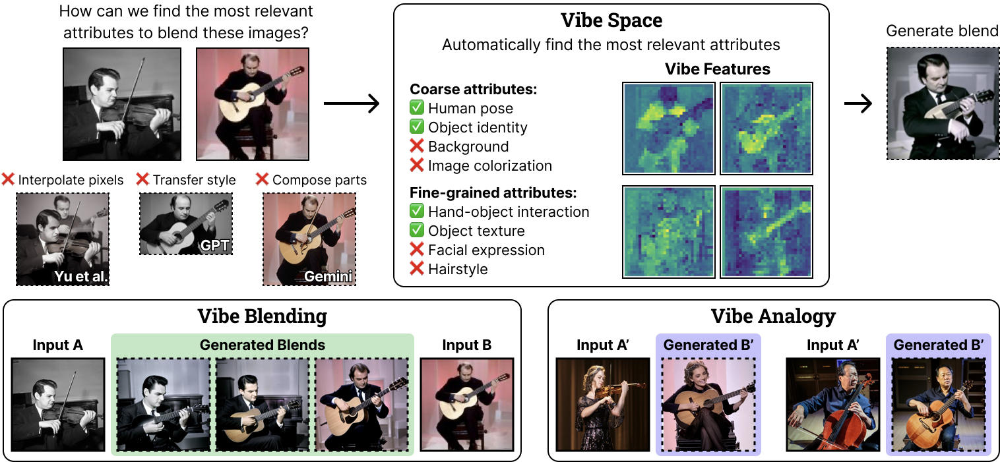
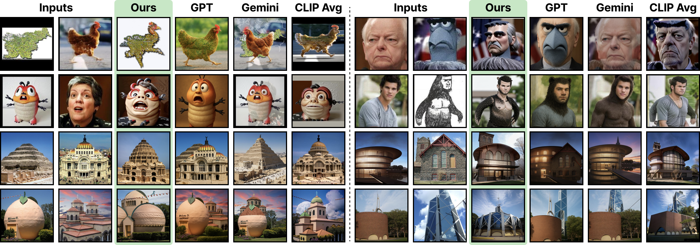
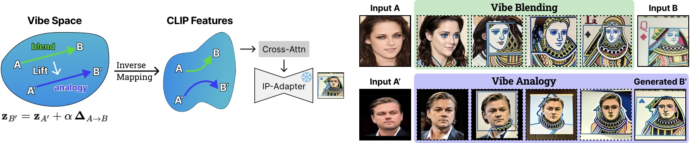
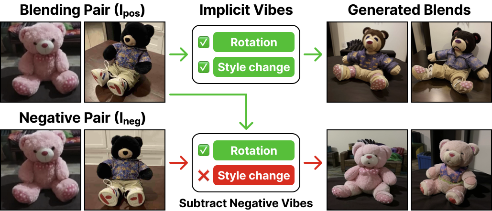
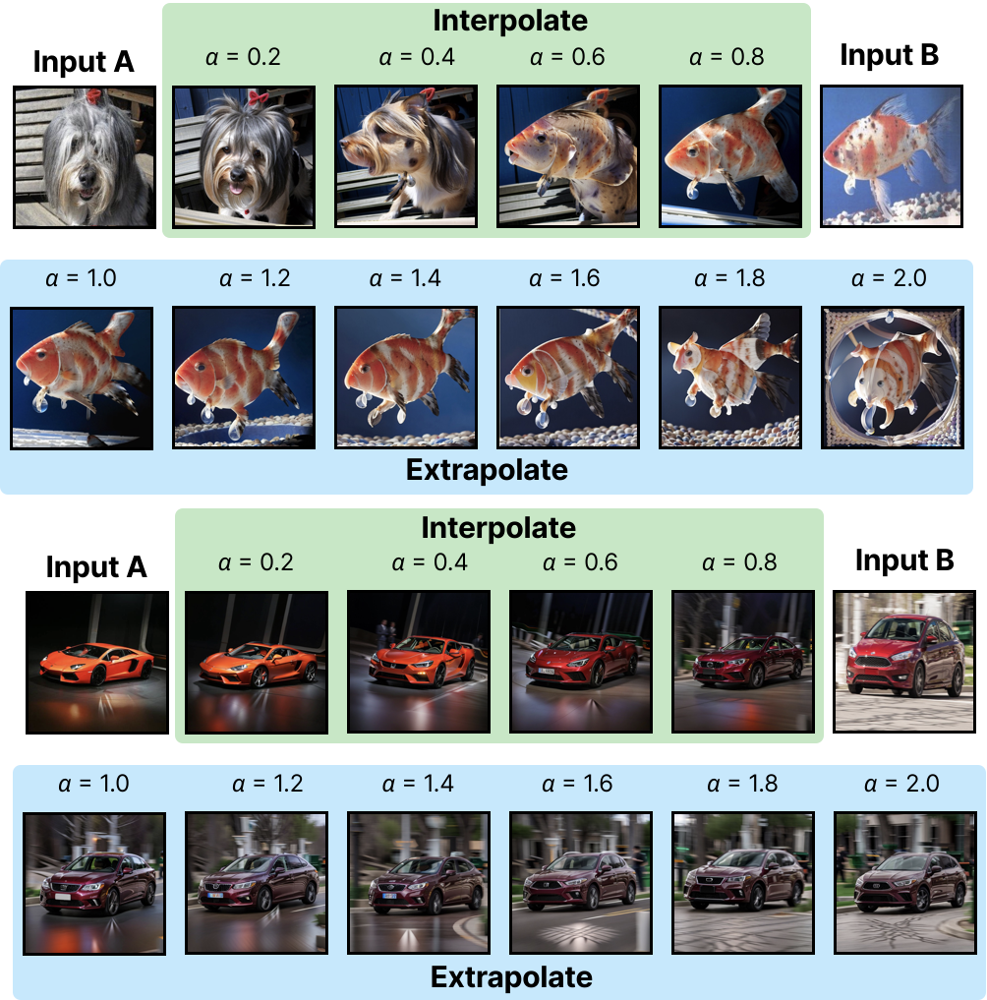
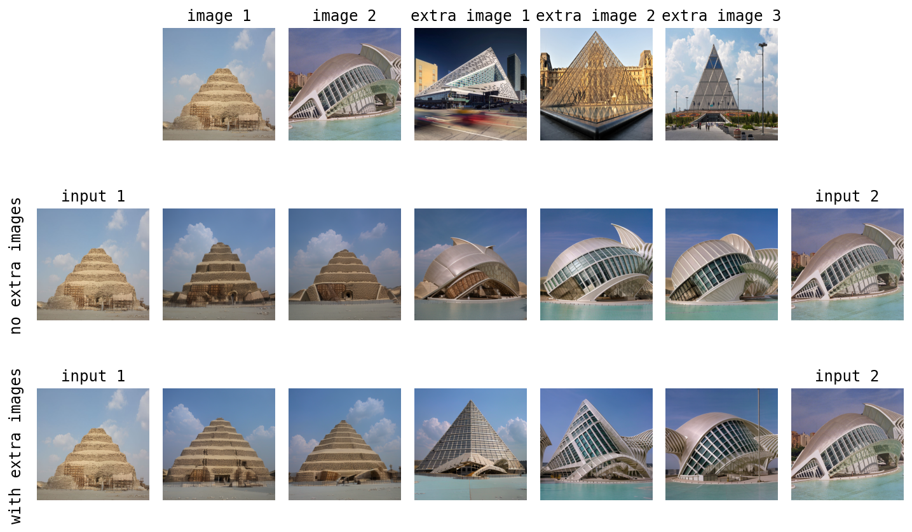
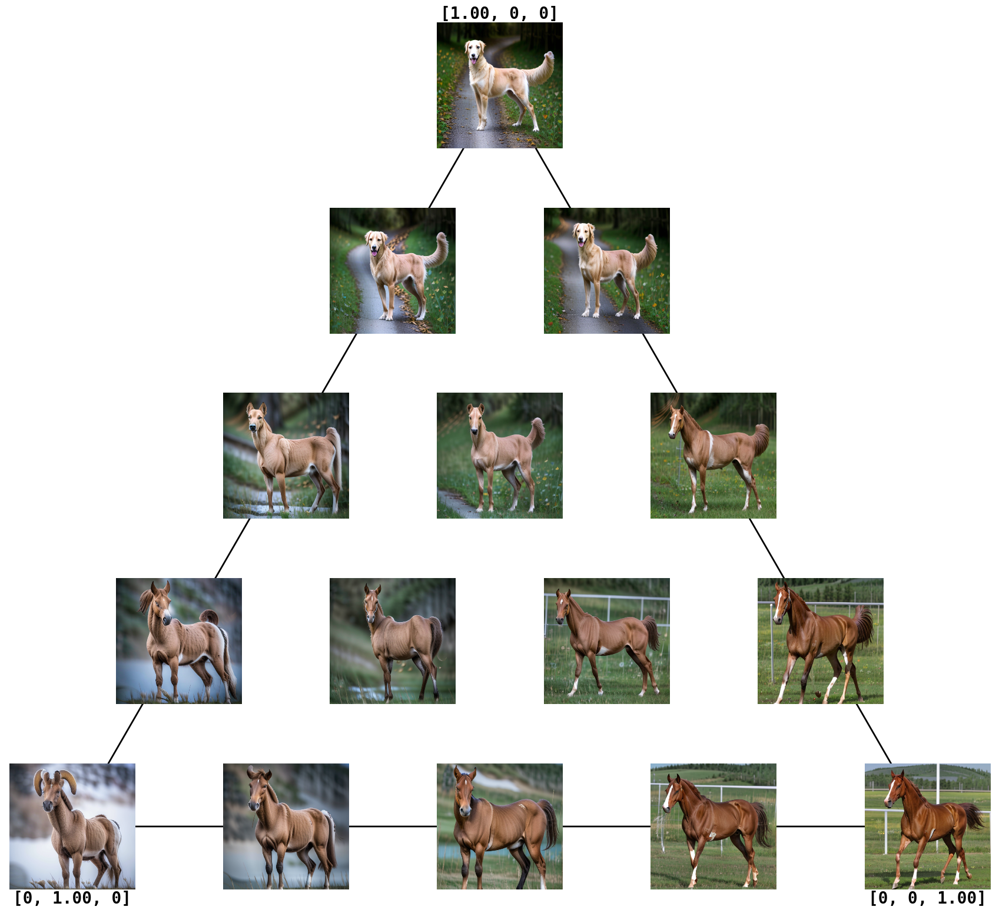

# Vibe Spaces for Creatively Connecting and Expressing Visual Concepts

<p align="center">
  <a href="https://huzeyann.github.io/VibeSpace-webpage/">
    
  </a>
  <a href="https://huggingface.co/spaces/huzey/VibeSpace">
    
  </a>
  <a href="#">
    
  </a>
</p>

**Authors:** [Huzheng Yang](https://huzeyann.github.io)<sup>1</sup>, [Katherine Xu](https://k8xu.github.io)<sup>1</sup>, [Andrew Lu](https://scholar.google.com/citations?user=L61d7OUAAAAJ&hl=en)<sup>1</sup>, [Michael D. Grossberg](https://crest.cuny.edu/our-team/michael-grossberg)<sup>2</sup>, [Yutong Bai](https://yutongbai.com)<sup>3</sup>, [Jianbo Shi](https://www.cis.upenn.edu/~jshi)<sup>1</sup>

<sup>1</sup>UPenn, <sup>2</sup>CUNY, <sup>3</sup>UC Berkeley

---

## Overview

<p align="center">
  
</p>

We introduce **Vibe Space**, a hierarchical graph manifold that learns low-dimensional geodesics in feature spaces like CLIP, enabling smooth and semantically consistent transitions between concepts.

Consider blending a musician playing a violin with one playing a guitar. Different approaches identify different relevant attributes:
- **LLMs (Gemini, GPT)** might focus on object parts or style transfer
- **Musicians** would attend to the instrument and how it is played

The intuitive process of identifying and fusing meaningful attributes—the **"vibe"**—reveals creative connections between distinct concepts.

> *The term "vibe," short for "vibration," originated in 1960s jazz slang to describe the mood or feeling conveyed by music, a person, or space.*

## Installation

```bash
pip install -r requirements.txt
```

## Usage

### Gradio Demo

```bash
python -m src.app
```

Or try the online demo: [🤗 Hugging Face Space](https://huggingface.co/spaces/huzey/VibeSpace)

### Jupyter Notebook

See `demo_vibe_blending.ipynb` for interactive examples.

---

## Capabilities

### Vibe Blending
Creates coherent hybrids that merge the relevant shared attributes between images.

<p align="center">
  
</p>

### Vibe Analogy
With the discovered vibe, we can extrapolate to nontrivial but related concepts, enabling creative analogies that go beyond simple interpolation.

<p align="center">
  
</p>

### Negative Vibe Control
Vibe attributes are implicitly extracted by Vibe Space. The blending pair defines desired vibes, while negative pairs define vibes to suppress. By subtracting the negative vibe, we can control which attributes are blended.

<p align="center">
  
</p>

### Extrapolation
Vibe Space can extrapolate beyond the input images to generate related concepts by extending the vibe path.

<p align="center">
  
</p>

### Training with Extra Images
Although two images suffice to train the Vibe Space, adding related exemplars can enhance the dominant attributes and suppress spurious ones.

<p align="center">
  
</p>

### N-Image Blending
Vibe Space can blend multiple images simultaneously, discovering shared attributes across multiple concepts.

<p align="center">
  
</p>

---

## Citation

```bibtex
@article{yang2025vibespace,
  title={Vibe Spaces for Creatively Connecting and Expressing Visual Concepts},
  author={Yang, Huzheng and Xu, Katherine and Lu, Andrew and Grossberg, Michael D. and Bai, Yutong and Shi, Jianbo},
  year={2025}
}
```
